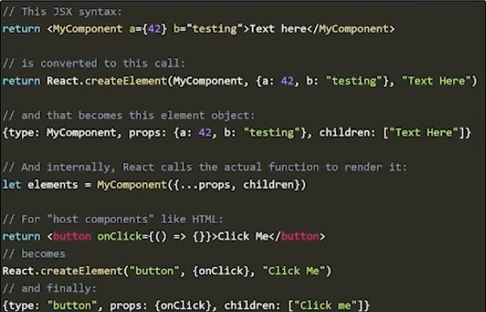
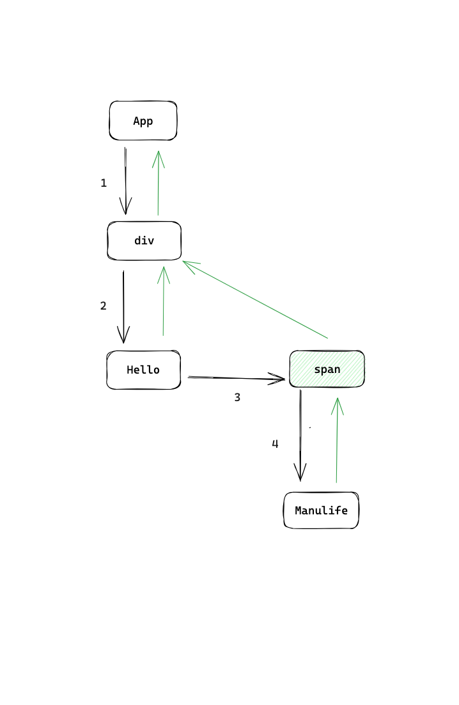
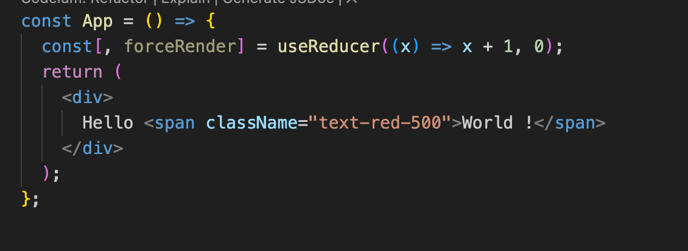
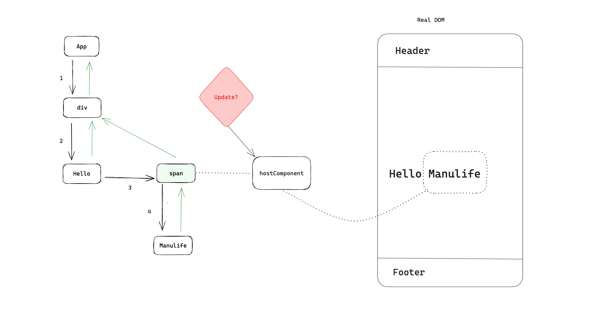
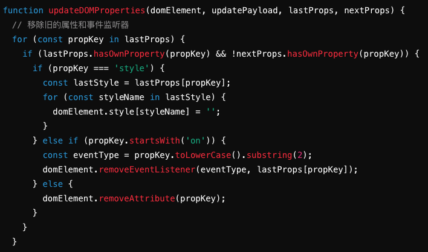
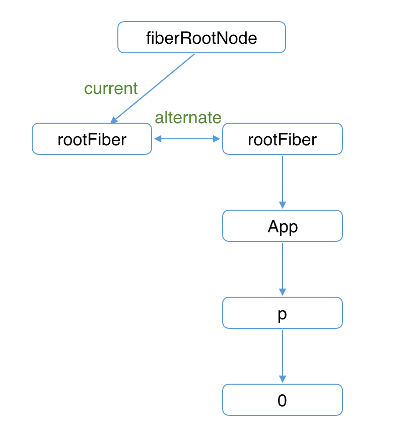
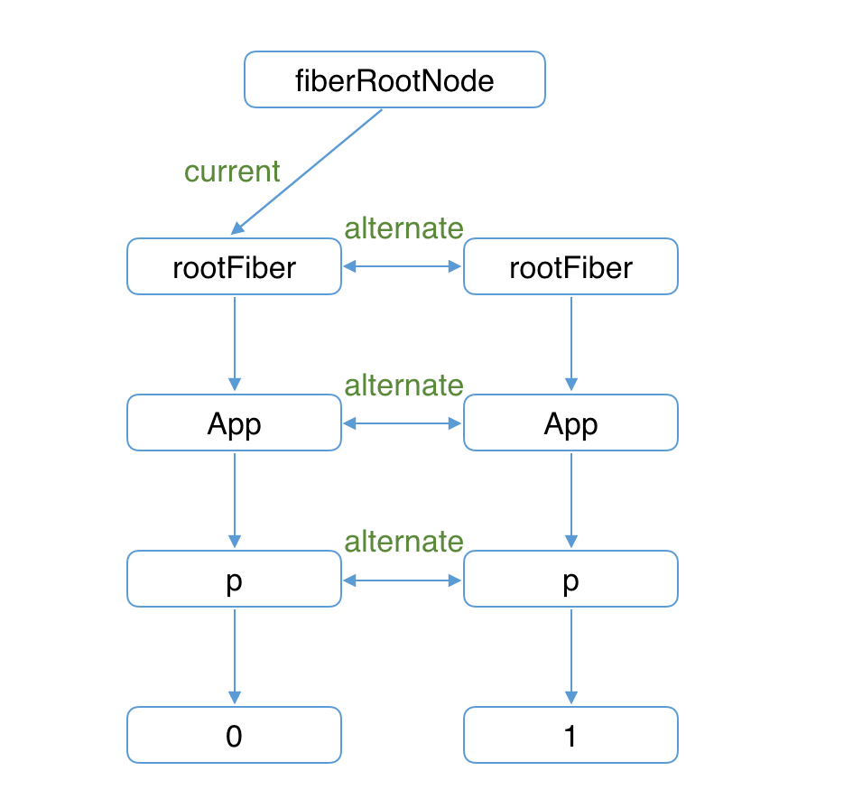

---
# try also 'default' to start simple
theme: seriph
# random image from a curated Unsplash collection by Anthony
# like them? see https://unsplash.com/collections/94734566/slidev
background: https://cover.sli.dev
# some information about your slides, markdown enabled
title: React Advaced rendering
info: |
  ## Slidev Starter Template
  Presentation slides for developers.

  Learn more at [Sli.dev](https://sli.dev)
# apply any unocss classes to the current slide
class: text-center
# https://sli.dev/custom/highlighters.html
highlighter: shiki
# https://sli.dev/guide/drawing
drawings:
  persist: false
# slide transition: https://sli.dev/guide/animations#slide-transitions
transition: slide-left
# enable MDC Syntax: https://sli.dev/guide/syntax#mdc-syntax
mdc: true
---

# React - rendering

Cooper Duan

<div class="pt-12">
  <span @click="$slidev.nav.next" class="px-2 py-1 rounded cursor-pointer" hover="bg-white bg-opacity-10">
    <!-- Let's start <carbon:arrow-right class="inline"/> -->
  </span>
</div>

<div class="abs-br m-6 flex gap-2">
  <!-- <button @click="$slidev.nav.openInEditor()" title="Open in Editor" class="text-xl slidev-icon-btn opacity-50 !border-none !hover:text-white">
    <carbon:edit />
  </button> -->
  <!-- <a href="https://github.com/slidevjs/slidev" target="_blank" alt="GitHub" title="Open in GitHub"
    class="text-xl slidev-icon-btn opacity-50 !border-none !hover:text-white">
    <carbon-logo-github />
  </a> -->
</div>

<!--
The last comment block of each slide will be treated as slide notes. It will be visible and editable in Presenter Mode along with the slide. [Read more in the docs](https://sli.dev/guide/syntax.html#notes)
-->

---
transition: fade-out
layout: two-cols
layoutClass: gap-16
---

# What is "Rendering"?

"Rendering" is a process React asking components to describe what they want the UI to look like, based on the current component's `props` and `state`.

- **React Element** - `JSX` will eventually be compiled into a call to `React.createElement` at compile time.
- **React tree** - the entire component tree
- **Reconciliation** - Diff the previous element tree vs the current element tree to decide what actual changes are necessary
<br>
<br>

::right::


```jsx
const element = React.createElement(
  'div' | HeaderComponent,      // type
  { className: 'container' },   // props
  'Hello, world!'               // children
);
```


<!--
You can have `style` tag in markdown to override the style for the current page.
Learn more: https://sli.dev/guide/syntax#embedded-styles
-->

<style>
h1 {
  background-color: #2B90B6;
  background-image: linear-gradient(45deg, #4EC5D4 10%, #146b8c 20%);
  background-size: 100%;
  -webkit-background-clip: text;
  -moz-background-clip: text;
  -webkit-text-fill-color: transparent;
  -moz-text-fill-color: transparent;
}
</style>

<!--
Here is another comment.
-->

---
transition: slide-up
level: 2
layout: two-cols
layoutClass: gap-16
---

# Render and Commit phases

Each rendering process is divided into two phases

## Render

Excute component function render and calculating changes.   
<!-- Ask the components what do you want the UI look like, and mark the components which need to be updated. This phase can be interrupted and A rendering process consists of multiple small microtasks.  -->
- React loops over the entire component tree, finds components marked for updates
- Calls components to render them and collects the element tree

::right::


---
transition: slide-up
layout: two-cols
layoutClass: gap-16
---

# Render and Commit phases

Each rendering process is divided into two phases

## Commit

Apply changes to the DOM and excute effects and lifecyles
- sync apply DOM updates 
- Effects and class component lifecycles, run cleanup

::right::


```  
functoin App() {

  useEffect(() => {
    console.log('2')
  })

  useLayoutEffect(() => {
    console.log('1')
  })
  
  return <div>...</div>
}

```

---
transition: slide-up
level: 2
layout: two-cols
layoutClass: gap-16
---

# How to trigger rendering

Every React render starts with a state update call

## Function components

- `useState`
- `useReducer`
- `useSyncExternalStore` 


## Class components

- `this.setState()`
- `this.forceUpdate()`
::right::


 

---
transition: slide-up
level: 2
layout: two-cols
layoutClass: gap-16
---

# Standard render flow

Rendering a component will by default cause all components inside of it to be rendered.

###### Tips:
In normal rendering, React does not care whether "props changed", component will render just because parent component rendered.

::right::

``` 

A > B > C > D

A call setState   
B render    
C render cause by B   
D render cause by C   

```

---
transition: slide-left
level: 2
layout: two-cols
layoutClass: gap-16
---

# Rendering vs DOM Updates

"Rendering" does not mean "apply updates to the DOM"

- A component may return an equivalent tree of elements as last time. So no changes need to be Update DOM here
- React have to go through the process of rendering and find which component need to be updated

::right::



---
transition: slide-left
level: 2
---

# Rules of React Rendering

"Rendering" must be "pure" and not have any "side effects".     
"side effects" means to break render things, like mutate a props is very bad.

## Render logic can
- mutate objects that were newly created while rendering
- throw errorss
- "Lazy initialize"

## Render logic can not
- mutate existing variables and objects
- make network requests


---
transition: fade-out
level: 2
layout: two-cols
layoutClass: gap-16
---

# Fibers

React store component "instance" and metadata in internal "Fiber" object.
- props and state
- hooks and class instance
- Pointers to parent, sibling, and child components
- metadata that React uses to track rendering process

::right::

<!-- This allow you to embed external code blocks -->
<<< @/snippets/fiberNode.ts#snippet


---
transition: fade-out
level: 2
layout: two-cols
layoutClass: gap-16
---

# The two fiber tree

React keeps two fiber tree currentFiber and workInProgressFiber


mount: 


::right::

render: 


---
transition: fade-out
level: 2
layout: two-cols
layoutClass: gap-16
---

# Rendering optimization

## Component Types

React reuses existing component instances and DOM nodes as much as possible.  
We can do something to speed up reconciliation
- reuse type: `if(prevElement.type !== currentElement.type)` React assumes sub tree will be different   

it means React will destory that entire existing component tree including all DOM nodes.  
we can return the same type every time to speed up rendering.
::right::

````md magic-move {lines: true}
```tsx {*|1,6|*}
// bad
// it creates a new ChildComponent every time
const App = () => {
  function ChildComponent() {
    return <div>child</div>;
  }
  return <ChildComponent />;
};

```

```tsx {*|2-4|*}
function ChildComponent() {
  return <div>child</div>;
}
const App = () => {
  return <ChildComponent />;
};
```
````

---
transition: fade-out
level: 2
layout: two-cols
layoutClass: gap-16
---

# Rendering optimization

## Key

React identifies component instances via `<App key="app-unique-id" />`

- `key` cannot pass from parent to child component

React implements fast list updates by detecting keys

::right::

```tsx
const App = () => {
  return data.map((item) => <Item key={item.key} />)
}
```
<br />
<br />

```tsx
// tips: The optimization will only take effect after the component is rendered for the first time
const App = () => {
  return isActive 
    ? <AComponent key="A" /> 
    : <BComponent key="B />
}
```

<br />
<br />

```tsx
// tips: The optimization will only take effect after the component is rendered for the first time
const App = () => {
  const data = useMemo(() => isActive ? <AComponent /> : <AComponent />, [isActive])
  return data
}
```


---
transition: fade-out
level: 2
layout: two-cols
layoutClass: gap-16
---


# Async Rendering and Closures

Extremely common user mistake:    
set new value, then try to log the existing variable.
It it not work in React.

Common answer:    
"React rendering is async".
Really two reasons:
- render will be sync, but the event handler is a "closures", 
- and it still sees the original value the component last rendered.

::right::

````md magic-move {lines: true}

```tsx {*|6-9|*}
import React, { useState } from 'react';

function Example() {
  const [count, setCount] = useState(0);

  const onClick = () => {
      setCount(count + 1);
      console.log("count: ", count);
  }

  return (
    <div>
      <p>{count}</p>
      <button onClick={onClick}>Increment</button>
    </div>
  );
}

export default Example;

```
```tsx {*|6-13|*}
import React, { useState } from 'react';

function Example() {
  const [count, setCount] = useState(0);

  function onClickFactory(capturedCount) {
    return function() {
      setCount(capturedCount + 1);
      console.log("count: ", capturedCount);
    };
  }

  const onClick = onClickFactory(count);

  return (
    <div>
      <p>{count}</p>
      <button onClick={onClick}>Increment</button>
    </div>
  );
}

export default Example;

```
````

---
transition: fade-out
level: 2
layout: two-cols
layoutClass: gap-16
---


# Training

What happen here? and how to fix it.

````md magic-move {lines: true, at: 1}
```tsx
function Avatar({ id }){
  const [data, setData] = useState(null);
  useEffect(() => {
    fetchData(`/api/user/${id}`).then((res) => {
      setData(res.data)
    }) 
  })

  return data
}
```
```tsx {*|7|*}
// 1. add dependencies
function Avatar({ id }){
  const [data, setData] = useState(null);
  const [loading, setLoading] = useState(true);

  useEffect(() => {
    fetchData(`/api/user/${id}`).then((res) => {
      setData(res.data)
    }) 
  }, [id])
  return data
}

```

```tsx
// 2. Add loading
function Avatar({ id }){
  const [data, setData] = useState(null);
  const [loading, setLoading] = useState(true);

  useEffect(() => {
    setLoading(true); // Start loading
    fetchData(`/api/user/${id}`)
      .then((res) => {
        setData(res.data)
      })
      .finally(() => {
        setLoading(false);
      })
  }, [id])
  return data
}
```
````

::right::


```tsx
// 3. Avoiding memory issues
// 4. Exception handling
function Avatar({ id }) {
  const [data, setData] = useState(null);
  const [loading, setLoading] = useState(true);
  useEffect(() => {
    let isMounted = true; // Track if component is mounted
    const getData = async () => {
      setLoading(true); // Start loading
      try {
        const res = await fetch(`/api/user/${id}`).then(res => res.json())
        if (isMounted) {
          setData(res.data);
          setLoading(false); // Finish loading
        }
      } catch (error) {
        if (isMounted) {
          console.error("Error fetching data:", error);
          setLoading(false); // Finish loading even if there is an error
        }
      }
    };
    getData();
    return () => {
      isMounted = false; // Cleanup function
    };
  }, [id]); // Dependency array

  if (loading) return <div>Loading...</div>;
  if (!data) return <div>No data available</div>;
  return <div>{data}</div>;
}

export default Avatar;

```


---
transition: fade-out
level: 2
---

# SWR 

You can use third-party libraries to simplify logic

```tsx

function Avatar({ id }){
  const { data, isLoading, error }= useSWR(`/api/user/${id}`);
  }, [id])

  if (loading) return <div>Loading...</div>;
  if (!data) return <div>No data available</div>;
  return <div>{data}</div>;
}

```

---
# try also 'default' to start simple
theme: seriph
# random image from a curated Unsplash collection by Anthony
# like them? see https://unsplash.com/collections/94734566/slidev
background: https://cover.sli.dev
# some information about your slides, markdown enabled
title: Thank you
# apply any unocss classes to the current slide
class: text-center
mdc: true
---

<br/>
<br/>
<br/>
<br/>
<br/>
<br/>
<br/>

# Thank you

Cooper Duan

<div class="pt-12">
  <span @click="$slidev.nav.next" class="px-2 py-1 rounded cursor-pointer" hover="bg-white bg-opacity-10">
    <!-- Let's start <carbon:arrow-right class="inline"/> -->
  </span>
</div>

<div class="abs-br m-6 flex gap-2">
  <!-- <button @click="$slidev.nav.openInEditor()" title="Open in Editor" class="text-xl slidev-icon-btn opacity-50 !border-none !hover:text-white">
    <carbon:edit />
  </button> -->
  <!-- <a href="https://github.com/slidevjs/slidev" target="_blank" alt="GitHub" title="Open in GitHub"
    class="text-xl slidev-icon-btn opacity-50 !border-none !hover:text-white">
    <carbon-logo-github />
  </a> -->
</div>

